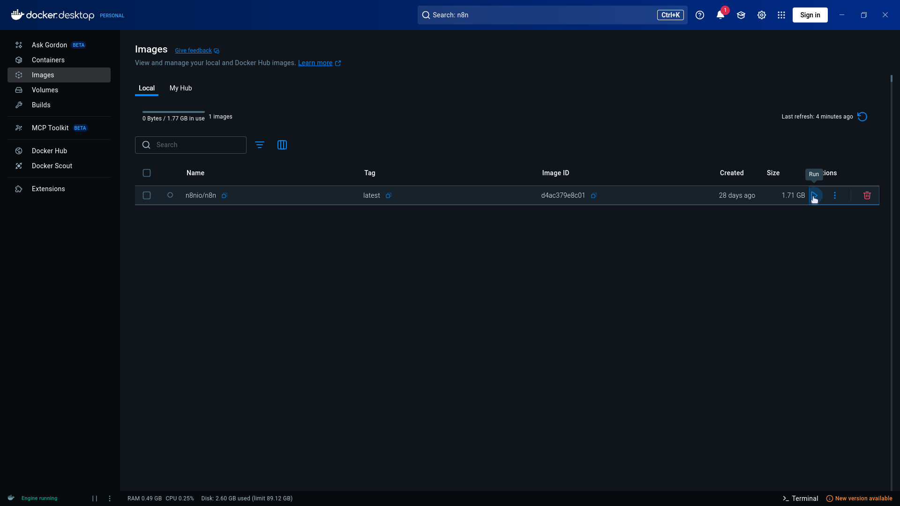
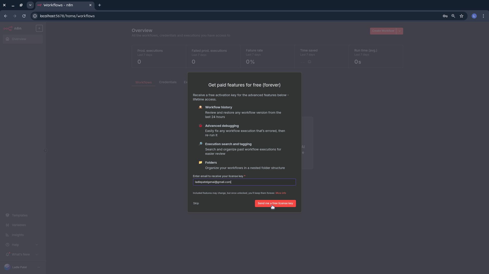
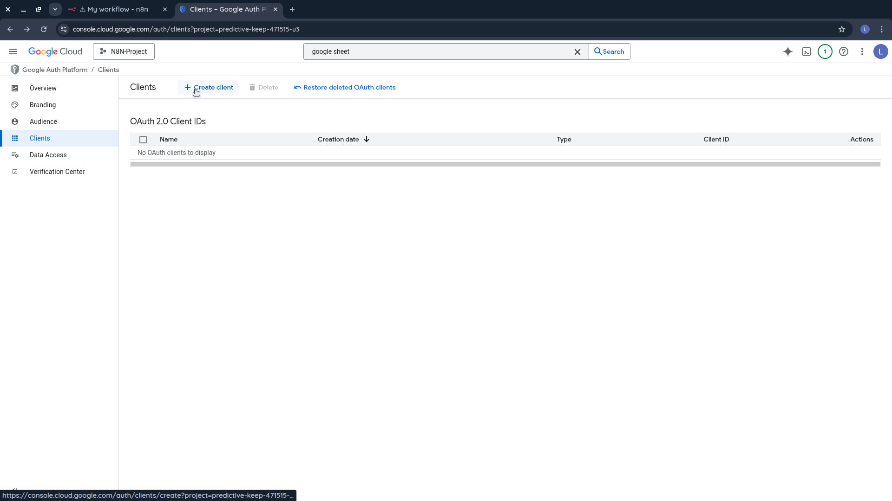

# N8N Financial Automation Workflow

A comprehensive guide to setting up an automated financial reporting system using N8N, Docker, Google Sheets, and AI-powered analysis. This workflow automatically processes your financial data from Google Sheets and generates detailed monthly reports sent via email.

## Overview

This project demonstrates how to create an end-to-end financial automation system that:

- Pulls transaction data from Google Sheets
- Filters data for the previous month
- Generates AI-powered financial insights using Groq
- Sends beautifully formatted HTML reports via Gmail

## Prerequisites

- Docker Desktop installed on your system
- Google account with access to Google Cloud Console
- Groq account for AI analysis
- Basic understanding of workflow automation

## Table of Contents

- [Docker Installation & N8N Setup](#docker-installation--n8n-setup)
- [N8N Initial Configuration](#n8n-initial-configuration)
- [Google Sheets Integration](#google-sheets-integration)
- [AI Analysis Setup](#ai-analysis-setup)
- [Gmail Integration](#gmail-integration)
- [Workflow Testing](#workflow-testing)

## Docker Installation & N8N Setup

### Step 1: Download Docker Desktop

Visit [Docker Desktop](https://www.docker.com/products/docker-desktop/) and download the appropriate version for your operating system.

![Docker Desktop Download] 

### Step 2: Pull N8N Image

1. Open Docker Desktop application
2. Search for **n8n** in the search bar (look for `n8nio/n8n:latest`)

![N8N Search] 

3. Pull the image by clicking the pull button

![Pull N8N Image] 

### Step 3: Access Images Panel

Navigate to the **Images** panel in the left sidebar of Docker Desktop.

![Images Panel] 

### Step 4: Run N8N Container

1. Locate the `n8nio/n8n` image and click the **Run** button (play icon)
2. Configure the container settings:
   - **Container name**: n8n
   - **Port**: 5678
3. Click **Run** to start the container

![Run Container] 


### Step 5: Verify Container Status

Go to the **Containers** panel in the left sidebar. You should see your n8n container running with a green status indicator and port mapping `5678:5678`.

![Verify Container] 

### Step 6: Access N8N Interface

Click on the port link (arrow icon) to open the n8n web interface.
![Access N8N] 

## N8N Initial Configuration

### Step 7: Initial Setup

Complete the n8n setup form with your email, first name, last name, and password, then click **Next**.

![ Setup N8N] 

### Step 8: Company Information

Fill in your company description and details as prompted, then click **Get Started**.

![Company Information] 

### Step 9: Skip License Key

When prompted about the license key email, click **Skip** to continue with the free version.

![Skip License] 

### Step 10: Access Dashboard

You'll now see the n8n dashboard. Click **Start From Scratch** to begin creating your workflow.

![Access Dashboard] 

## Workflow Creation

### Step 11: Create First Workflow

Click **Start From Scratch** to begin building your financial automation workflow.

### Step 12: Add Manual Trigger

1. Click **Add first step**
2. Select **Trigger Manually** from the right panel

![Start From Scratch] 

### Step 13: Add Google Sheets Node

1. Click the **plus (+)** button to add a new node
2. Search for **Google Sheets** in the right panel and select it

![Add Google Sheets] 

![Spreadsheet Selection] 

## Google Sheets Integration

### Step 15: Setup Google Credentials

1. Click **Select Credentials**
2. Choose **Create New Credentials**

![Credentials Dialog] 

### Step 16: Google Cloud Console Setup

1. Open a new tab and navigate to [Google Cloud Console](https://console.cloud.google.com/)
2. Ensure you're logged in to your Google account
3. Click **Create New Project**

![Google Cloud Console] 

### Step 17: Create New Project

Click **New Project** and enter your project name, then click **Create**.

![New Project] 

![Project Creation] 

### Step 18: Select Project

Click **Select Project** in the top-right corner to ensure your new project is active.

![Select Project] 

### Step 19: Enable Google Sheets API

1. Search for **Google Sheets API**
2. Click on the result and click **Enable**
3. After enabling, click **Manage**

![Google Sheets API] 

![Google Sheets API] 

### Step 20: Enable Google Drive API

1. Search for **Google Drive API** in the search bar
2. Click on the API result and click **Enable**
3. Wait for the API to be enabled

### Step 21: Configure OAuth Consent Screen

1. Click **Configure Consent Screen**
2. Click **Get Started**
3. Enter your app name and email
4. Set audience to **External**
5. Add your contact email
6. Check the agreement checkbox and click **Continue**, then **Create**
   ![OAuth Consent] 

### Step 22: Configure Data Access Scopes

1. Navigate to **OAuth Consent Screen** in the left panel
2. Click **Data Access**
3. Click **Add or Remove Scopes**
4. Search for **Google Sheets API**
5. Check all relevant toggles and click **Update**

![Data Access Scopes] 
![Data Access Scopes] 

1. Scroll down and click **Save**

![Save Scopes] 

### Step 23: Add Test Users

1. Click **Audience** in the left panel
2. Click **Add Users**
3. Enter your email address and click **Save**

![Add Users] 

### Step 24: Create OAuth Client

1. In the left panel, click **Clients**
2. Click **Create Client**
3. Set application type to **Web Application**
4. Enter a client name
5. Copy the redirect URL from your n8n window

![Create Client] 

### Step 25: Configure Redirect URI

1. Under **Authorized Redirect URIs**, click **Add URI**
2. Paste the redirect URL from n8n
3. Click **Create**

### Step 26: Copy Client Credentials

You'll see a popup with your **Client ID** and **Client Secret**. Copy both values as you'll need them for n8n.

![Client Credentials] 

### Step 27: Connect N8N to Google

1. Return to your n8n workflow
2. Paste the **Client ID** and **Client Secret** into the respective fields
3. Click **Sign in with Google**

### Step 28: Authorize Application

1. A popup will appear - click on your email
2. Click **Continue**
3. Check all permission boxes
4. Scroll down and click **Continue**
5. You should see "Account is connected"

![Connect N8N to Google] 

### Step 29: Create Sample Data

1. Navigate to [Google Sheets](https://docs.google.com/spreadsheets/u/0/)
2. Click on **Blank Spreadsheet**
3. Add the following sample financial data:

![Google Sheets Creation] 

```csv
    Date Category Description Amount Type
    2025-08-01 Salary Monthly salary payment 5000 Income
    2025-08-20 Freelance Web design project 1200 Income
    2025-08-20 Rent Apartment rent 1500 Expense
    2025-08-13 Groceries Supermarket shopping 450 Expense
    2025-08-17 Dining Restaurant dinner 120 Expense
    2025-07-14 Utilities Electricity bill 200 Expense
    2025-08-23 Transport Gas + maintenance 250 Expense
    2025-08-14 Bonus Mid-year performance bonus 800 Income
    2025-07-23 Shopping Electronics purchase 900 Expense
    2025-07-27 Entertainment Movie & subscriptions 150 Expense
    2025-08-20 Interest Bank savings interest 75 Income
    2025-07-30 Healthcare Doctor visit + medicines 300 Expense
```

4. Save the spreadsheet

### Step 30: Configure Sheets Operation

1. Return to your n8n workflow
2. Set **Resource** to "Sheet"
3. Set **Operation** to "Get Rows"
4. Select your spreadsheet from **Document from List**
5. Select **Sheet1** from the sheet list
6. Click **Execute Step** at the top

![Sheets Operation] 

## Data Processing & AI Analysis

### Step 31: Add Code Node for Data Filtering

1. Click the **plus (+)** symbol after the Google Sheets node
2. Search for **Code** and select it

### Step 32: Configure JavaScript Filter

Select **JavaScript** and paste the following code to filter last month's transactions:

```javascript
// Convert Google Sheets serial date to JS Date (if needed)
function serialDateToJSDate(serial) {
const jsDate = new Date((serial - 25569) * 86400 * 1000);
jsDate.setUTCHours(0, 0, 0, 0);
return jsDate;
}

const now = new Date();
const lastMonthStart = new Date(now.getFullYear(), now.getMonth() - 1, 1);
const lastMonthEnd = new Date(now.getFullYear(), now.getMonth(), 0);

console.log(Filtering between ${lastMonthStart.toISOString().split('T')} and ${lastMonthEnd.toISOString().split('T')});

// Get all rows from input
const rows = $input.all().map(item => item.json);

const filtered = rows.filter(row => {
if (!row.Date) return false;

let date;
if (!isNaN(row.Date)) {
// If Google Sheets gave a serial number
date = serialDateToJSDate(Number(row.Date));
} else {
date = new Date(row.Date);
}

return date >= lastMonthStart && date <= lastMonthEnd;
});

console.log(Found ${filtered.length} transactions);

// Return in same n8n {json: {...}} structure
return filtered.map(row => ({
json: {
Date: row.Date,
Category: row.Category,
Description: row.Description,
Amount: row.Amount,
Type: row.Type,
}
}));
```

![Add Code Node] 

## AI Analysis Setup

### Step 33: Add AI Agent Node

1. Click the **plus (+)** button after the Code node
2. Search for **AI Agent** and select it

### Step 34: Configure AI Prompt

1. Click **Source** for prompt and select **Define Below**
2. Add the following comprehensive financial analysis prompt:
3.

```prompt

Act as a finance assistant.

Task → From the given JSON array of transactions, generate a pure HTML email body with the following rules:

Output only valid HTML — no explanations, no reasoning text, no Markdown.

Use only these tags: <h1>, <h2>, <p>, <ul>, <ol>, <li>, <table>, <tr>, <th>, <td>.

Apply inline styles to each <td> and <th>: border:1px solid #ddd; padding:12px; text-align:center;

<th> should also have font-weight:bold; background:#f2f2f2;
Income amounts → color:#4CAF50;

Expense amounts → color:#F44336;

All tables and the values must be centered (set text-align:center on each cell).

Sections required (in this exact order, nothing else):

<h1>Monthly Financial Summary</h1>
<h2>Key Metrics</h2> (Total Income, Total Expenses, Net Savings/Loss, Transaction Count)
<h2>Category Breakdown</h2> (table with Category | Amount | % of spend | Count)
<h2>Insights</h2> (4–5 bullet points with observations)
<h2>Transactions</h2> (full table with Date | Category | Description | Amount | Type, with income/expense coloring)
Format currency as ﷼#,###.## in Riyal style.

Return only the HTML body. Do not output explanations, comments, or any extra text outside the HTML.

JSON Input: {{JSON.stringify($input.all().map(item => item.json), null, 2)}}
```

![Add Code Node] 

### Step 35: Configure AI Settings

Click **Settings** and toggle on **Execute Once** to ensure the AI processes all data in a single execution.
![Ai Setting] 

### Step 36: Add Groq Chat Model

1. Click the **plus (+)** button in the Chat Model section
2. Search for **Groq Chat Model** and select it

![ Chat Model] 

### Step 37: Create Groq Account

1. Open a new tab and navigate to [Groq Console](https://console.groq.com/home)
2. Enter your email to create a new account

![Create Account] 

### Step 38: Verify Email

Check your Gmail inbox for the Groq verification email and click **Login** to complete the signup process.
![Verify Email] 

### Step 39: Generate API Key

1. After logging in, click **API Keys** in the top-right header
2. Click **Create API Key**
3. Enter a display name and click **Submit**
4. Copy the generated API key

![Generate API Key] 

### Step 40: Configure Groq Credentials

1. Return to your n8n workflow
2. Paste the API key into the credentials field
3. Click **Save** - you should see "Connection Successful"
4. Select the model **deepseek-r1**

![Groq Signup] 
![Model Selection] 

## Gmail Integration

### Step 41: Add Gmail Node

1. Click the **plus (+)** button after the AI Agent
2. Search for **Gmail** and select it
3. Choose **Send a Message** operation

### Step 42: Enable Gmail API

1. Open a new tab and go to [Google Cloud Console](https://console.cloud.google.com/)
2. Select your project
3. Search for **Gmail API** and click on it
4. Click **Enable** and wait for it to complete

### Step 43: Configure Gmail OAuth Scopes

1. In the left panel, click **OAuth Consent Screen**
2. Click **Data Access**
3. Click **Add or Remove Scopes**
4. Search for **Gmail API** on the right panel
5. Check all relevant scopes, scroll down and click **Update**
6. Scroll down and click **Save**
   ![Gmail Scopes] 

### Step 44: Configure OAuth Client for Gmail

1. In the left panel, click **Clients**
2. Select the OAuth client you created earlier
3. Clic on Add Secret
4. Copy the Client Secret and Client ID

![Oauth Client] 

### Step 45: Copy the Client Secret and Client ID

![Gmail Credentials] 

### Step 46: Connect Gmail to N8N

1. Return to your n8n workflow
2. Paste the **Client Secret** and **Client ID**
3. Click **Sign in with Google**
4. A window will open - click on your Google account
5. Click **Continue** and select all checkboxes
6. Scroll down and click **Continue**
7. You should see "Your account is connected"

![Connect Gmail] 

### Step 47: Configure Email Settings

Configure the Gmail node with the following settings:

- **Operation**: Send
- **To**: your-email@gmail.com
- **Subject**: `📊 Monthly Finance Report - {{ new Date().toLocaleDateString('en-US', { month: 'long', year: 'numeric' }) }}`
- **Email Type**: HTML
- **Message**: ` {{ $json.text.replace(/<think>[\s\S]*?<\/think>/gi, "").replace(/``````/gi, "").trim() }} `

![Gmail Client Setup] 

### Step 48: Save and Test Workflow

Click **Save** to save your complete workflow.

![Gmail Connection] 

## Workflow Testing

Now Click on Manual Trigger. Node will start processing.

### Step 49: Check Your Email

Navigate to [Gmail](https://gmail.com) and check your inbox for the automated financial report.
![Email Result] 

## Features

- **Automated Data Processing**: Filters transactions from the previous month
- **AI-Powered Analysis**: Generates insights using advanced language models
- **Professional Reporting**: Creates beautifully formatted HTML email reports
- **Multi-Platform Integration**: Connects Google Sheets, AI services, and Gmail
- **Scheduled Execution**: Can be configured to run automatically

## Troubleshooting

### Common Issues

1. **Container won't start**: Ensure Docker Desktop is running and port 5678 is not in use
2. **Google API errors**: Verify all APIs are enabled and OAuth scopes are properly configured
3. **Email not sending**: Check Gmail API permissions and OAuth credentials
4. **Data not filtering**: Ensure your Google Sheets data follows the correct date format

---

**Congratulations!** You've successfully set up a complete automated financial reporting system using N8N, Docker, and various cloud services. Your workflow will now process financial data and generate comprehensive monthly reports automatically.
